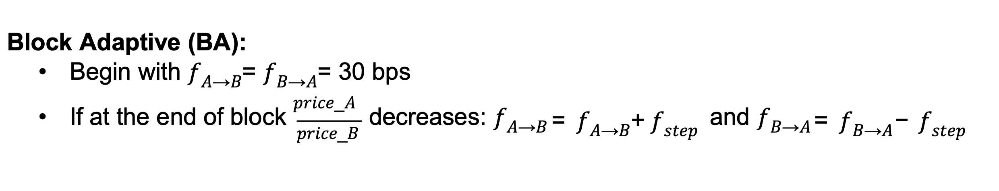

### Types of dynamic Fees

1. Block-adaptive 
Idea: if A becomes less desirable (price A / price B decreases), then traders will likely want to get more of token B
That means that the volume A -> B increases
We want to reflect that by increasing a fee in the A -> B direction: 
F_ab = F_ab + F_step

F_step = 5 bps (1 bps = 1 basic point = 1 / 100 %)

F_initial = 30 bps

2. MEVCheck Hook

Source: https://github.com/MrLightspeed/MEVChargeHook

MEV (Maximal Extractable Value) - the maximum profit that block producers see by looking at pending transaction in a blockchain

How we mitigate MEV: 

For the ModifyLiquidity operations:

- Anti-JIT penalties (when liquidity is provided Just In Time and then removed)

When liquidity is removed 

penalty = fee * (time elapsed) / block_offset

this is donated to the pool 

For the Swap operations:

- Trading too soon in the opposite direction (sandwitching)

timeFee = (currentTime - lastTradeTime) / cooldownPeriod

- Impact Fee 

impactFee = tradeAmount / totalLiquidity

Total fee = max(TradingFee, impactFee)

3. PegStability Hook

Source: https://github.com/Renzo-Protocol/foundational-hooks

A hook to keep DEX price B above CEX price B (pegging token B)

Idea: if token B is bought from the pool (so its price increases) or DEX price B is already more than CEX price B
Then we stimulate swaps by keeping the minimum fee

On the other hand, Fee = percentage difference between Pool Price and CEX Price

4. Deal Adaptive Hook (DAHook)
Idea: if the last swap was A -> B   
Then slightly increase fee in that direction: feeAB = feeAB + delta   
And decrese fee in another direction: feeBA = feeBA - delta   

