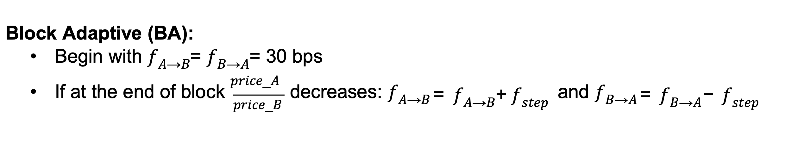
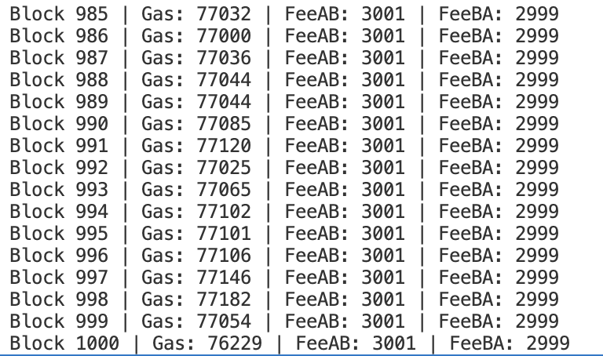
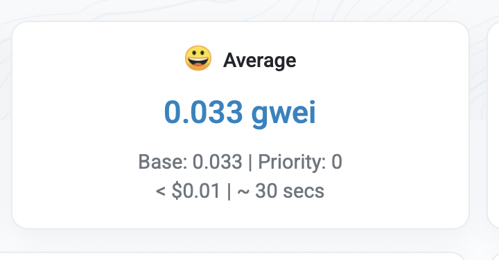
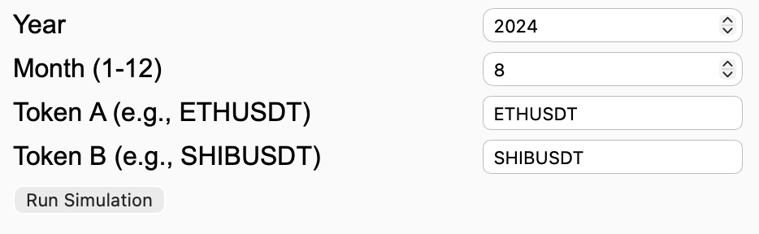
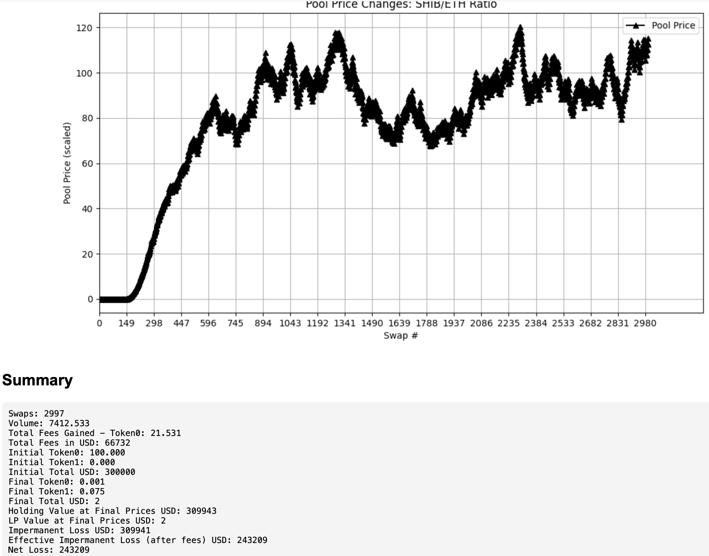
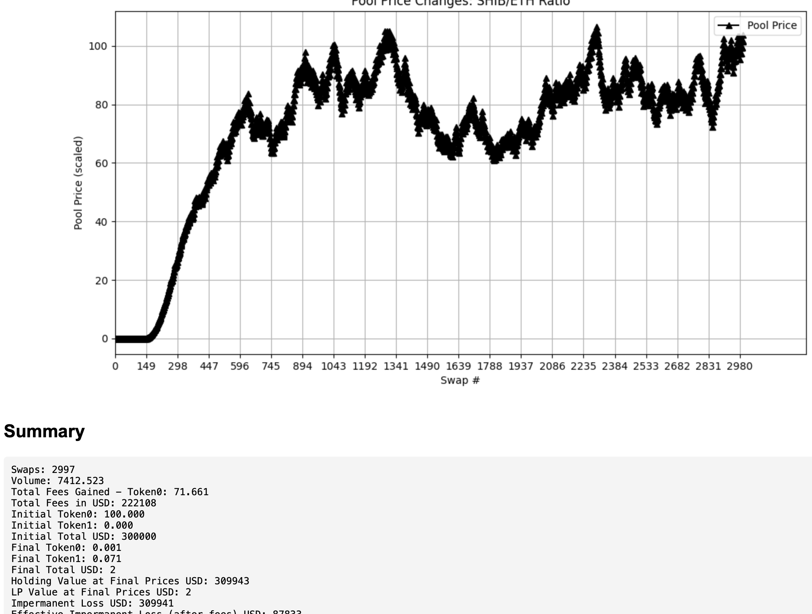
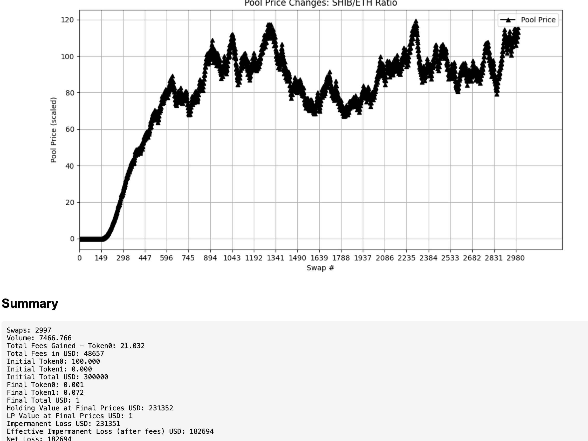
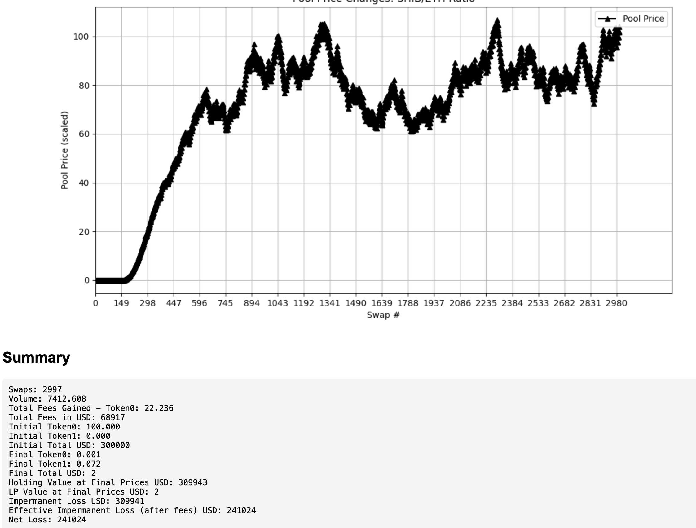
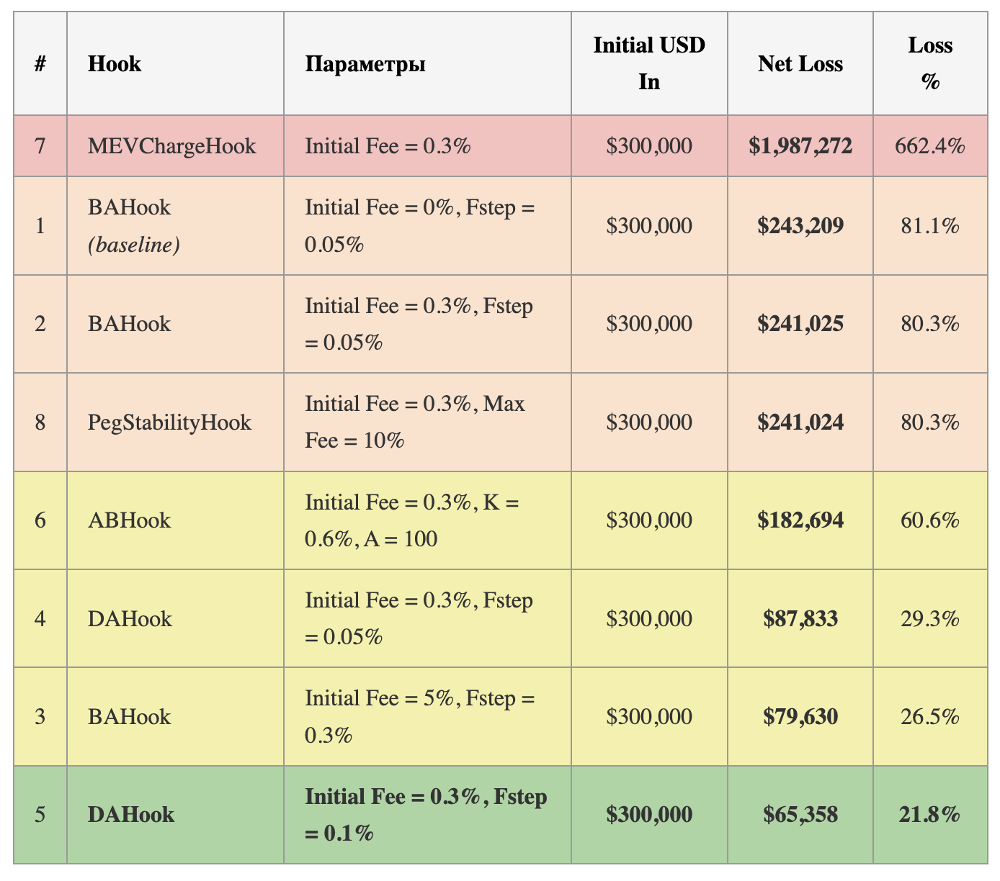

### Types of dynamic Fees

1. Block-adaptive 
Idea: if A becomes less desirable (CEX price A / price B decreases), then traders will likely want to get more of token B
That means that the volume A -> B increases
We want to reflect that by increasing a fee in the A -> B direction: 
F_ab = F_ab + F_step

F_step = 5 bps (1 bps = 1 basic point = 1 / 100 %)

F_initial = 30 bps

2. MEVCheck Hook

Source: https://github.com/MrLightspeed/MEVChargeHook

MEV (Maximal Extractable Value) - the maximum profit that block producers see by looking at pending transaction in a blockchain

How we mitigate MEV: 

For the ModifyLiquidity operations:

- Anti-JIT penalties (when liquidity is provided Just In Time and then removed)

When liquidity is removed 

penalty = fee * (blocks elapsed) / block_offset

this is donated to the pool 

For the Swap operations:

- Trading too soon in the opposite direction (sandwitching)

timeFee = (currentTime - lastTradeTime) / cooldownPeriod

- Impact Fee 

impactFee = tradeAmount / totalLiquidity

Total fee = max(timeFee, impactFee)

3. PegStability Hook

Source: https://github.com/Renzo-Protocol/foundational-hooks

A hook to keep DEX price B above CEX price B (pegging token B)

Idea: if token B is bought from the pool (so its price increases) or DEX price B is already more than CEX price B
Then we stimulate swaps by keeping the minimum fee

On the other hand, Fee = percentage difference between Pool Price and CEX Price

4. Deal Adaptive Hook (DAHook)
Idea: if the last swap was A -> B   
Then slightly increase fee in that direction: feeAB = feeAB + delta   
And decrese fee in another direction: feeBA = feeBA - delta   

5. AMM Based Hook (ABHook)
Idea: If the last swap was A -> B and AMM price changed by $\delta$   
Then feeAB = feeAB + A * $\delta$ (A > 0)   
Where A is a constant     
And we keep a constant sum of fees:     
feeAB + feeBA = K   

So feeBA = K - feeAB    

### Gas usage

On average 77200 units
1 unit = 0.033 gwei = 10^(-9) * 0.033 ETH
Price of 1 ETH is around $3,000
1 unit = 10^(-9) * 0.033 ETH = 10^(-9) * 0.033 * 3000 USD = 10^(-7) USD

1 swap = 77200 * 10^(-7) USD = 0.008 USD

# Comparing different methods 

Testing parameters 

1. BA Hook. Initial Fee = 0% (baseline) Fstep = 0.05%

Initial total USD in: $300,000

Net Loss: $243,209

2. BA Hook. Initial Fee = 0.3% Fstep = 0.05%

Initial total USD in: $300,000

Net Loss: $241,025

3. BA Hook. Initial Fee = 5% Fstep = 0.3%

Initial total USD in: $300,000

Net Loss: $79,630

4. DA Hook. Initial Fee = 0.3% Fstep = 0.05%

Initial total USD in: $300,000

Net Loss: $87,833

5. DA Hook. Initial Fee = 0.3% Fstep = 0.1%

Initial total USD in: $300,000

Net Loss: $65,358

6. AB Hook. Initial Fee = 0.3% K = 0.6% A = 100

Initial total USD in: $300,000

Net Loss: $182,694

7. MEVChargeHook. Initial Fee = 0.3%

Initial total USD in: $300,000

Net Loss: $1,987,272

8. PegStability Hook. Initial Fee = 0.3% Max Fee = 10%

Initial total USD in: $300,000

Net Loss: $241,024

<table style="border-collapse: collapse; width: 100%; font-family: serif;">
  <thead>
    <tr style="background-color: #f5f5f5;">
      <th style="border: 1px solid #999; padding: 10px 14px; text-align: center;">#</th>
      <th style="border: 1px solid #999; padding: 10px 14px; text-align: left;">Hook</th>
      <th style="border: 1px solid #999; padding: 10px 14px; text-align: left;">Параметры</th>
      <th style="border: 1px solid #999; padding: 10px 14px; text-align: center;">Initial USD In</th>
      <th style="border: 1px solid #999; padding: 10px 14px; text-align: center;">Net Loss</th>
      <th style="border: 1px solid #999; padding: 10px 14px; text-align: center;">Loss %</th>
    </tr>
  </thead>
  <tbody>
    <tr style="background-color: #f9c0bfff;">
      <td style="border: 1px solid #999; padding: 8px 14px; text-align: center;">7</td>
      <td style="border: 1px solid #999; padding: 8px 14px;">MEVChargeHook</td>
      <td style="border: 1px solid #999; padding: 8px 14px;">Initial Fee = 0.3%</td>
      <td style="border: 1px solid #999; padding: 8px 14px; text-align: center;">$300,000</td>
      <td style="border: 1px solid #999; padding: 8px 14px; text-align: center; font-weight: bold;">$1,987,272</td>
      <td style="border: 1px solid #999; padding: 8px 14px; text-align: center;">662.4%</td>
    </tr>
    <tr style="background-color: #fee1cbff;"">
      <td style="border: 1px solid #999; padding: 8px 14px; text-align: center;">1</td>
      <td style="border: 1px solid #999; padding: 8px 14px;">BAHook <em>(baseline)</em></td>
      <td style="border: 1px solid #999; padding: 8px 14px;">Initial Fee = 0%, Fstep = 0.05%</td>
      <td style="border: 1px solid #999; padding: 8px 14px; text-align: center;">$300,000</td>
      <td style="border: 1px solid #999; padding: 8px 14px; text-align: center; font-weight: bold;">$243,209</td>
      <td style="border: 1px solid #999; padding: 8px 14px; text-align: center;">81.1%</td>
    </tr>
    <tr style="background-color: #fee1cbff;"">
      <td style="border: 1px solid #999; padding: 8px 14px; text-align: center;">2</td>
      <td style="border: 1px solid #999; padding: 8px 14px;">BAHook</td>
      <td style="border: 1px solid #999; padding: 8px 14px;">Initial Fee = 0.3%, Fstep = 0.05%</td>
      <td style="border: 1px solid #999; padding: 8px 14px; text-align: center;">$300,000</td>
      <td style="border: 1px solid #999; padding: 8px 14px; text-align: center; font-weight: bold;">$241,025</td>
      <td style="border: 1px solid #999; padding: 8px 14px; text-align: center;">80.3%</td>
    </tr>
    <tr style="background-color: #fee1cbff;"">
      <td style="border: 1px solid #999; padding: 8px 14px; text-align: center;">8</td>
      <td style="border: 1px solid #999; padding: 8px 14px;">PegStabilityHook</td>
      <td style="border: 1px solid #999; padding: 8px 14px;">Initial Fee = 0.3%, Max Fee = 10%</td>
      <td style="border: 1px solid #999; padding: 8px 14px; text-align: center;">$300,000</td>
      <td style="border: 1px solid #999; padding: 8px 14px; text-align: center; font-weight: bold;">$241,024</td>
      <td style="border: 1px solid #999; padding: 8px 14px; text-align: center;">80.3%</td>
    </tr>
    <tr style="background-color: #f5f0a8;">
      <td style="border: 1px solid #999; padding: 8px 14px; text-align: center;">6</td>
      <td style="border: 1px solid #999; padding: 8px 14px;">ABHook</td>
      <td style="border: 1px solid #999; padding: 8px 14px;">Initial Fee = 0.3%, K = 0.6%, A = 100</td>
      <td style="border: 1px solid #999; padding: 8px 14px; text-align: center;">$300,000</td>
      <td style="border: 1px solid #999; padding: 8px 14px; text-align: center; font-weight: bold;">$182,694</td>
      <td style="border: 1px solid #999; padding: 8px 14px; text-align: center;">60.6%</td>
    </tr>
    <tr style="background-color: #f5f0a8;">
      <td style="border: 1px solid #999; padding: 8px 14px; text-align: center;">4</td>
      <td style="border: 1px solid #999; padding: 8px 14px;">DAHook</td>
      <td style="border: 1px solid #999; padding: 8px 14px;">Initial Fee = 0.3%, Fstep = 0.05%</td>
      <td style="border: 1px solid #999; padding: 8px 14px; text-align: center;">$300,000</td>
      <td style="border: 1px solid #999; padding: 8px 14px; text-align: center; font-weight: bold;">$87,833</td>
      <td style="border: 1px solid #999; padding: 8px 14px; text-align: center;">29.3%</td>
    </tr>
    <tr style="background-color: #f5f0a8;">
      <td style="border: 1px solid #999; padding: 8px 14px; text-align: center;">3</td>
      <td style="border: 1px solid #999; padding: 8px 14px;">BAHook</td>
      <td style="border: 1px solid #999; padding: 8px 14px;">Initial Fee = 5%, Fstep = 0.3%</td>
      <td style="border: 1px solid #999; padding: 8px 14px; text-align: center;">$300,000</td>
      <td style="border: 1px solid #999; padding: 8px 14px; text-align: center; font-weight: bold;">$79,630</td>
      <td style="border: 1px solid #999; padding: 8px 14px; text-align: center;">26.5%</td>
    </tr>
    <tr style="background-color: #a8d5a2;">
      <td style="border: 1px solid #999; padding: 8px 14px; text-align: center;">5</td>
      <td style="border: 1px solid #999; padding: 8px 14px; font-weight: bold;">DAHook</td>
      <td style="border: 1px solid #999; padding: 8px 14px; font-weight: bold;">Initial Fee = 0.3%, Fstep = 0.1%</td>
      <td style="border: 1px solid #999; padding: 8px 14px; text-align: center; font-weight: bold;">$300,000</td>
      <td style="border: 1px solid #999; padding: 8px 14px; text-align: center; font-weight: bold;">$65,358</td>
      <td style="border: 1px solid #999; padding: 8px 14px; text-align: center; font-weight: bold;">21.8%</td>
    </tr>
  </tbody>
</table>

Image

