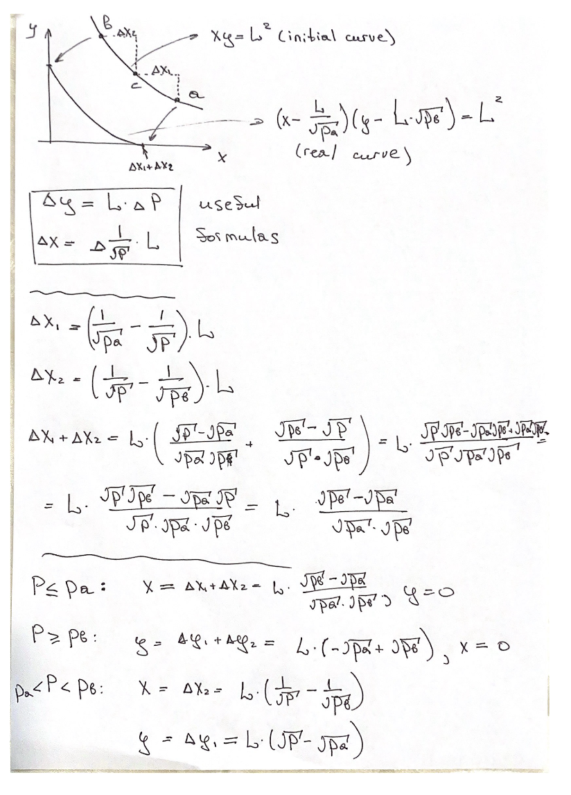

Forge - a toolkit for dApps
Just like Python, it can build projects and execute code
Plust it can have its own virtual environments

forge init folder - initialize a forge project

Installing dependencies (seen in foundry.toml):

forge install uniswap/v4-core
forge install uniswap/v4-periphery

forge install - add all dependencies
forge test - test


Mint - mean you add the liquidity to the pool (token A + token B) and then you get LP (Liquidity Provider) tokens back to represent your share of the pool

tick = a point on the price curve 
They are chosen so that Price(i) = Price(start) * 1.0001 ^ i
So each tick increases price in 1.0001

When minting (adding liquidity to a pool):

Tick boundaries = when your liquidity is earning fees

MaxAmounts = at the time of the minting, how much slippage you are willing to accept

Q64.96 - a 160 (64 + 96) integer

If I have a float - we will store it as 
float * 2 ^ 96 (moving the decimal point 96 bits to the right in a binary representation)

----

function processData(bytes calldata data)
It means that you cannot modify the variable data within the function
(Most storage efficient)

----

Blockchain 

The nodes have the ledges with blocks that contain information about all the deployed contracts and transactions

When you write in Solidity, your code then gets converted into bytecode 

Then you want to send it to the chain 

For that, you first choose a provider (endpoint)
It is just a node that will accept your transaction and propagate in on the blockchain
Below is the code that gets you a provider
(Note: Metamask is both a wallet and a provider)

// You use a library that knows Ethereum nodes
const provider = new ethers.JsonRpcProvider("https://mainnet.infura.io/v3/your-key");
// or
const provider = new ethers.BrowserProvider(window.ethereum); // MetaMask

The you sign the transacation with your private key 

const signer = await provider.getSigner();

Then you send the transaction using your provider
The interface below essentaily converts you transaction to a bytecode

const tx = await contract.swap(...);

When the node receives the transaction, it can check it using your signature
(Note: your public key is the address the transaction came from)
Cool!

----

Callback function

Let's say I execute A.func()

Inside A.func() there's a code that executes the function within my contract:

A.func() {
  do MyContract.callback()
}

contract MyContract {
  callback () {
    ...
  }
}

In blockchain, you always know which contract sent the function
Because functions only exist within contract!
So cool
address caller = msg.sender

-----

ETH is created daily out of thin air and distributed among stakers
Then each transaction costs some fee
The node what added the transaction to the block (it's called a validator) get's a portion of the fee 
The other part is burned 

-----

ETH blockchain stores both user addresses and contract addresses

payble() - in a type conversion that you can do with any address. It allows to send some ETH to that acount 
payble(address).transfer(...)

// Contract that handles ETH
contract MyContract {
    function receiveETH() public payable {
        // Can receive ETH
    }
}

// Calling code
MyContract contract = MyContract(0x123...);

// Need to convert to payable to send ETH
payable(address(contract)).transfer(1 ether);
// OR
contract.receiveETH{value: 1 ether}();

How type conversion works:

type = address: basic type 
only has .balance(), .call(), .code() basic funtionality (could be a user address or a contract address)

type = payable: type that you can send ETH to
payable(address).transfer(...)

type = IERC20: a ERC20 token interface
Supports certain functions
IERC(address).transfer(recipient, amount)


-------

IERC20 interface: 

// 1. Check token balance of an address
function balanceOf(address account) returns (uint256)

// 2. Transfer tokens to someone
function transfer(address to, uint256 amount) returns (bool)

// 3. Check how much one address can spend from another
function allowance(address owner, address spender) returns (uint256)

// 4. Allow another address to spend your tokens (for DEXs, contracts)
function approve(address spender, uint256 amount) returns (bool)

// 5. Transfer from one address to another (with approval)
function transferFrom(address from, address to, uint256 amount) returns (bool)

// 6. Get total token supply
function totalSupply() returns (uint256)

--------

You code in Solidity is just some transactions

They convert to ETH bytecode

To execute them, you'd want to have a provider(the node that will receive your transaction) and a wallet(that will have ETH for transactions)

All those transactions will have the wallet address as a message sender

------

Contract factory - a contract that has a function to create another contract 

sault = encoding of tokenA, tokenB, fee (state of the pool)

How is the liquidity pool created? 
Liquidity pool is just another contract

myPool = ContractFacroty.createPool(sault)

Inside ContractFactory: 

ContractFactory {
  def createPool(sault) {
    return new MyContract(sault) // This deploys a new pool and returns its address
                                 // The address is calculated as keccak(msg.sender + 
                                 // sault + ...)
                                 //  Where msg.sender is a factory address!
  }
}


Using sault + a contract factory ensures we get the same address if we create the same pool:

If I just call new MyContract(), then the msg.sender will be different and so the keccak(msg.sender +sault + ...) changes

-------

keccak - just a hashing algorithm 
The name is not an acronym 

abi = application binary interface 
it turns parameters 

abi.encode(token, amount);
// → [32-byte offset][32-byte length][32-byte token][32-byte amount]

abi.encodePacked(token, amount);
// → [20-byte token][32-byte amount] (no padding!)
(more memory-efficient, collisions possible)

abi.encodeWithSignature("transfer(address,uint256)", recipient, amount);
// → [4-byte selector][32-byte recipient][32-byte amount]

bytes4 selector = bytes4(keccak256("transfer(address,uint256)"));
bytes memory data = abi.encodeWithSelector(selector, recipient, amount);
// Same output as encodeWithSignature

bytes - datatype, an array of bytes.
if we create:
bytes arr = new bytes(10) - 10 elements
bytes memory res = abi.encode(...) - the function reterns the bytes array where
res[-32:0] - encoding of the first element
res[-64:-32] - encoding of the second element and so on

-------

In solidity, we can call contract functions just like classes:
Obj.func()

That is because the Solidity compiler knows the defenition of Obj
and can make an appropriate bytecode out of it

If the contract is already deployed, you can call
address.call(abi.encodeWithSigranute(...))

So the Solidity, essentially, compiles the code into transaction calls which the ETH EVM can execute 

------

How we interact with a liquidity pool: 


------

Why is the blockchain secure: 


-----

// approve permit2 as a spender
IERC20(token).approve(address(permit2), type(uint256).max);

// approve `PositionManager` to use your set up permit2 to transfer the tokens
IAllowanceTransfer(address(permit2)).approve(token, address(positionManager), type(uint160).max, type(uint48).max);


-----

// defining a new type
type Currency is address;

// overload operations for the new created type
using {greaterThan as >, lessThan as <, greaterThanOrEqualTo as >=, equals as ==} for Currency global;

using CurrencyLibrary for Currency global;
// that means that you can call CurrencyLibrary methods on an instance of Currency contract

// Wraps this address in a Currency
Currency cur = Currency.wrap(address)

// Unwraps Currency into address
Address addr = Currency.unwrap(cur)


-----

// This Command Line command starts forge testing
// So forge deploys a fake Vm contract on the simulated Etherium-like environment
// There's no actual bytecode at this address
bash: forge test 

// Here you connect to this deployed contract
Vm vm = Vm(address)


// This is a forge cheatcode
// When you write it, forge understands that all the transactions below are real transcations that we send to the network (if it is set up)
vm.startBroadcast();


Your call: vm.startBroadcast()
            ↓
EVM: "Call function at 0x710970..."
            ↓
Foundry: "Oh, that's my cheatcode address! I'll handle this internally"

// CreatePoolAndAddLiquidity is designed to be a script
// It does not get deployed 
// forge just executes the commands from the run() function from your address
forge script MyScript.sol --broadcast
# ↓ Executes run() function automatically

// So all the calls to other functions within the run() function
// Are just pre-computations that don't do on-chain
// They are pre-computed in the compilation phase
// Only external contract calls (the ones that have addresses) become transactions
// Example: positionManager.mint(params);

------

There's only one pool with these specific parameters (like currencies, fee, tick spacing, hooks)

Idea: create a mechanism allowing everyone to create pools (but why, though?)

------

Swap Router - finds the best way to exchange your tokens
It has all the pools existing (as they are all created through a factory)
So it can look at all of them

-------

abstract contract - the one that cannot be deployed 
can have some virtual functions that don't have definitions 
Will be overrriden in child contracts

--------

Mint = create tokens out of thin air 
token.mint(address(this), 10_000_000 ether);
ether - is a unit measurement
1 ether = 10^18 
10_000_000 ether = 10_000_000 * 10^18 
This is how many units of a token we are minting 
For most tokens, 1 TOKEN = 10^18 pieces = 1 ether

--------

Idea: hashing by multiplying two matrices


--------

### How the blockchain works

We want a system with no central control
And no one participant depending on another
Which means every participant (node) has to have the full current state of the system to execute operations

Lots of people send transactions to the blockchain 
They are propagated along the network
When a node receives a transaction, it adds it to its pool

But a transaction arrives to different nodes at different times! 
So each block has it's own order or transactions:
Node A: Tx1 -> Tx2 -> Tx3
Node B: Tx3 ->Tx1 -> Tx2
Node C: Tx3 ->Tx2 ->Tx1

Who decides which is the correct order?
The Oracle problem
1. If we pick one node to decide, we're back to centralized systems
2. If we choose a node randomly, then it's possible to create a 10,000 fake nodes and have a very high chance to get selected
3. If we pick the time the first node received the transaction, then it's easily changeable when they transaction is propagated (anyone can say that he received the transaction at a different time)

That's why in blockchain there's a universal agreement that the "truth" node is the node who did some hard work and did it before all other nodes

Why does the work have to be hard?
Because otherwise everyone will do this work, spam the nodes with blocks that have different transaction orders, and there will be infinite chain splits
Meaning no way to say which one is the true one

The hard work could be anything (it's called mining)
So potentially any node can be the source of the "truth" (no centralization)

Then we want to incentivize the nodes to do this hard work
Otherwise, no one will do it as it costs electricity (stalled network)

To incentivize, we pay miners for their work.
But if we pay with usual currency, there are banks who control it 
And sending cash is inefficient

So we create a digital currency

What makes a curency valuable:
1. You can't get it out of thin air (low inflation)
2. You can buy something for it

At first we print some currency 
But we give it only to the nodes that have done some work (miners).
And then we say that each transaction costs some amount of that currency
So essentially you can buy the execution of the transactions you desire
That makes this currency valuable
And now people are willing to exchange it for real money

The more the nodes the the network, the better (because it gets harder to control the network)

### How adding a block works

Let's say I'm a normal node. When adding a new block, I want to make sure: 
1. The node that sent me this block actually knows the answer to the hard task
2. It was the one who was solving it
So that I don't get spammed with many blocks that are the same so I got to execute all the transactions to check correctness
I will only check the block that came from the source
3. This node has a current state of the blockchain (why is it needed?).
Meaning if I calculate all the transactions the state root will be the same as the one you sent me.
Answer: it allows the light nodes to just add the received state root to their blockchain without calculating the transactions
4. All the transactions are valid 

1. A node receives a document with all the transactions, a nonce (the asnwer to the hard task), and a block root (result of applying transaction to the current state of the blockchain)
2. It checks that if it applies all the transactions to its current blockchain state it will get the same block root (which proves 3.)
3. It checks that hash(transactions, a nonce, a root) is the same as the system's target (which proves 1.)
3. It Checks all the usual transactions using a public key (proves 4.) It also checks that these transactions are in the node's pool (i.e. they haven't been included earlier)
4. It also checks that the transcation that tells that a miner gets some currency belongs to a node that sent the block (which proves 2.)

Note: to prevent the same transaction being included twice, the node stores the current nonce for each address 
Each subsequent transcation from that address has a different nonce 
So even if two transactions do the same, if they are real, they have different nonces


-----

Library is a reusable peace of code that can be called by other contracts
It doesn't have storage and doesn't store ETH
In compilation, the library functions are just inserted into a contract that uses them

So using inhertiance and libraries you build your contract from many pieces 
If the contract doesn't call an external address, it does this action inside itself

EVM

Here's how the scripts work 

Scripts are just contracts that forge deploys locally on a simulation of a blockchain
When deploying, a constructor is always being ran

Meaning it's just an EVM with certain blockchain inside it
Each EMV has a block object, which defines the EVM's state
// Current block information
block.chainid      // Blockchain network ID (1 = Ethereum)
block.coinbase     // Miner/validator address
block.timestamp    // Current block timestamp (seconds)
block.number       // Current block number
block.difficulty   // Proof-of-work difficulty
block.gaslimit     // Block gas limit
block.basefee      // Base fee per gas (EIP-1559)

When forge creates a local EVM, it sets
block.id = 31337
You can also give forge an RPC URL (where a node is running)
Then it will copy the blockchain state from that node and will use it for the local simulation

It also deployes its special contract with a "vm" address
Those are cheatcodes

When you run the script, forge creates a transaction to execute the run() function that is defined inside this contract

When EVM executes a contract and sees something like vm.Broadcast() 
It understands it is a forge's cheatcode and runs separate logic for it

--------

### How forge scripts work

0. Forge pulls a copy of a blockchain (if provided), and deploys vm and script contract

1. Step 1: forge executes the script that is deployed on a copy of the blockchain (isolated copy)
2. Everything including external calls is executed
3. All the calls inside vm.broadcast() are added to the lst
4. Step 2: Then it copies the blockchain again (to capture new transactions that happened since it started Step 1) and executes the collected transactions
5. Step 3: Broadcasts transcations to the real network (if flag --broadcast was provided)

Documentation: https://getfoundry.sh/guides/scripting-with-solidity#how-forge-script-works

Question: what if an external call depends on the result of a previous external call?
Answer: it's all good! 
All the calls are executed at step 1, so when the next call is executed, it already knows all its parameters for execution

------

### Liquidity 

Liquidity is just a point on a price curve xy = k

Provide liquidity in the price range means to have a liquidity pool that allows the price point to move within this price range (and reach all the points inside the range)

Amount of liquidity L is the value sqrt(xy) = sqrt(k)
For each curve, it is a constant
Higher amount of liquidity means that the curve is higher so there are more reserves in it

In V2 protocol, there was just one price curve xy = k

In V3 protocol, the curve is divided into sections 
Each section lies between lower PriceA and higher PriceB
And on each one of the sections you can create a pool with its own curve 
And you define L how you like



------

### TokenId

Each liquidity position is minted as an NFT (ERC721 token)

tokenId uniquely identifies a specific liquidity position NFT

The contract stores a mapping that links each tokenId to:

PoolKey (which pool this position belongs to)

PositionInfo (liquidity amount, tick range, fees, etc.)

--------

### Revert 

Revert - throws an error 
Stops execution 
returns everything to the state before the call 
returns gas

### Error 

error Wrapped(address t, bytes4 selector, bytes reason, etc.) - a custom error type 

usage:
revert Wrapped(params)


CustomError.selector.revertWith() 
1. CustomError.selector - get a selector of a custom created error like Wrapped
2. call revertWith() function on this selector 
3. This function is defined in a CustomRevert library

-------

### Modifier 

Used to stop / continue running another function

From IHooks.sol:
modifier noSelfCall(IHooks self) {
    if (msg.sender != address(self)) {
        _;
    }
}

"-;" continues execution

Usage: 

function afterInitialize(IHooks self, PoolKey memory key, uint160 sqrtPriceX96, int24 tick)
    internal
    noSelfCall(self)
{
  ...
}


-------

# Position manager

In Uniswap V4: 

`IPermit2 permit2;` - handles token transfers from ERC720 contracts (you give it permission to transfer your tokens)

`IPoolManager poolManager;` - handles liquidity, ticks, fees, reserves

IPositionManager positionManager; - wrapper around poolManager
IUniswapV4Router04 swapRouter;


---------

# Address in function 

function _afterSwap(address) {

}

That means the function doesn't use the address parameter but it gets it anyways


--------

# Hook mechanism 

1. When you create a pool, you specifty a Hook contract to use 
Each pool has oly one hook contract

2. Then the pool calls the hook on certain actions like _beforeSwap()

3. Hook contract overrides this function from the BaseHook and performs specific logic 

4. The hook contract returns the selector of the original BeforeSwap function from BaseHook contract 
This tells the pool that the hook performed the intended operation (beforeSwap)

# How it all wors together 

1. You initialize a pool with something like this 

```
poolKey = PoolKey(currency0, currency1, 3000, 60, IHooks(hook));
        poolId = poolKey.toId();
        poolManager.initialize(poolKey, Constants.SQRT_PRICE_1_1);
```

Note: I'm not sure if a pool is contract at all 
Only poolManager is a contract 

You specify the `hook` address to use 

2. Then you call some function on a pool.  
For example, minting 

```
(tokenId,) = positionManager.mint(
            poolKey,
            tickLower,
            tickUpper,
            liquidityAmount,
            amount0Expected + 1,
            amount1Expected + 1,
            address(this),
            block.timestamp,
            Constants.ZERO_BYTES
        );
```

3. The `positionManager` contract calls the `beforeSwap()` function in your Hook 

But here's the catch 

beforeSwap() is defined in the `BaseHook` contract: 

```
    /**
     * @inheritdoc IHooks
     */
    function beforeInitialize(address sender, PoolKey calldata key, uint160 sqrtPriceX96)
        external
        onlyPoolManager
        returns (bytes4)
    {
        return _beforeInitialize(sender, key, sqrtPriceX96);
    }
```

So it uses `onlyPoolManager` modifier to check that the `msg.sender` is the predetermined PositionManager which we trust 

```
    modifier onlyPoolManager() {
        if (msg.sender != address(poolManager())) revert NotPoolManager();
        _;
    }
```

```
    function poolManager() public view virtual returns (IPoolManager) {
        return IPoolManager(0x000000000004444c5dc75cB358380D2e3dE08A90);
    }
```

Note: `poolManager` address is hardcoded!

After the `beforeSwap()` function is called it actually calls the `_beforeSwap()` function

And this function is already overriden in your contract! 

So that's how you run the specific logic 

```
    function _beforeSwap(address, PoolKey calldata key, SwapParams calldata, bytes calldata)
        internal
        override
        returns (bytes4, BeforeSwapDelta, uint24)
    {
        beforeSwapCount[key.toId()]++;
        return (BaseHook.beforeSwap.selector, BeforeSwapDeltaLibrary.ZERO_DELTA, 0);
    }
```

--------

# Running tests

1. `anvil --fork-url <YOUR_RPC_URL>` - create a local anvil chain
(if using --fork-url, it will copy this state of the blockchain)

2. Execute script 

```
forge script script/00_DeployHook.s.sol \
    --rpc-url http://localhost:8545 \
    --private-key <PRIVATE_KEY> \
    --broadcast
```

<PRIVATE_KEY> = 0xac0974bec39a17e36ba4a6b4d238ff944bacb478cbed5efcae784d7bf4f2ff80
Basic private key

Note: `forge test` creates its own internal network 
(so that's even a little bit better)

`--broadcast` means that the transactions that are marked as `vm.broadcast()` will be executed from your acount

-------

### Remappings.txt

this file contains remappings 

When forge sees

`import { PoolKey } from "@uniswap/v4-core/src/types/PoolKey.sol";`

it look in this file and finds the code 
and it looks at the remappings in your project root! 
And ignores remappings in a library's folder

When forge sees 

`import { PathKey } from "./PathKey.sol";`

It actually looks up the file following this path 
The root here is the actual file where this line is


