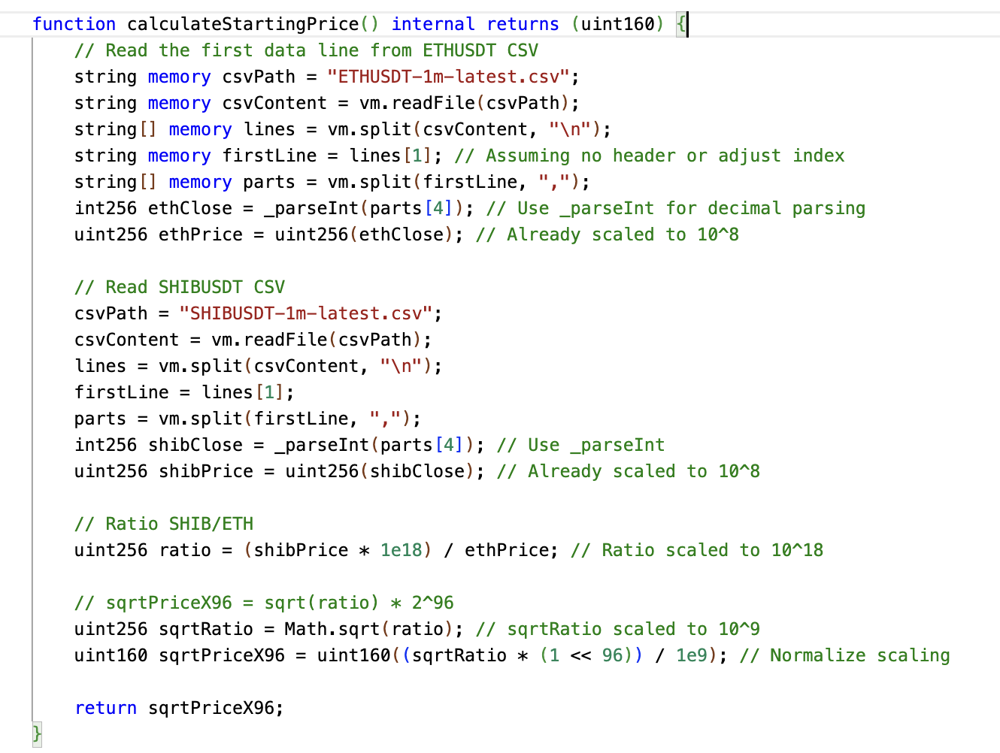
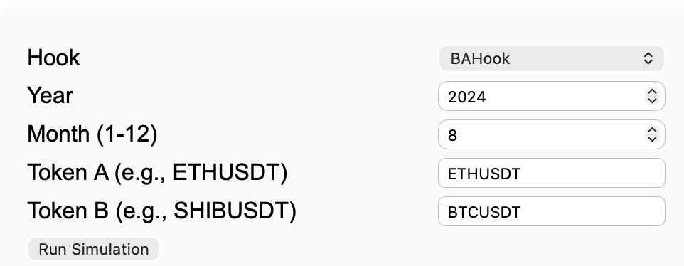

# Project Outline 

### There's a hook contract in `src/`
For example, `BAHook.sol`

It inherits from a `BaseOverrideFee` and also implements custom functions that are usefuls for tests
In order to access this custom functions we create a `IHooksExtended.sol` interface

### There're scripts in `script/`

#### Deploy Hook script `deployHook.s.sol`

Run using:  
`forge script script/DeployHook.s.sol BAHook 0 0 --rpc-url http://localhost:8545 --broadcast`.  
`params: <FeedAddress0, FeedAddress1>`

This script inherits from the `HookHelpers` contract

`HookHelpers` has these fields:
- priceFeed0, priceFeed1 - the price feeds contracts that are needed for dynamic fee hooks to get CEX prices
It has function `deployFeeds()` that automatically create mock feeds
This function is called in a constructor
It also has a function `deployHook()` which deploys a hook (it uses the given name of the hook and looks if it matches one of the imported hooks)

The `HookHelpers` contract itself inherits from `BaseScript` contract
`BaseScript` has these fields:
- tokens
- currencies (which are just token wrappers)
It also creates mock tokens in the constructor

The `BaseScript` contract is inherited from `Deployers` contract
`Deployers` has these fields:
- permit2
- poolManager
- positionManager
- swapRouter
Those are the aftifacts neccessary for pool and hook deployments
The contract has functions to set up these fields
Note: It doesn't have a constructor (because we want to use this contract as a utility)
If we are on the local blockchain (block.chainid = 31337) then those artifacts are also created
In the actual blockchain they are already deployed by Uniswap so just the addresses are used

Note: in the scripts we don't run deployToken() function of `Deployers`.    
Because it creates fake tokens that are useless on a real blockchain 

That's why we configure the token addresses manually in `BaseScript`

```
/////////////////////////////////////
    // --- Configure These ---
    /////////////////////////////////////
    IERC20 internal token0 = IERC20(0x0165878A594ca255338adfa4d48449f69242Eb8F);
    IERC20 internal token1 = IERC20(0xa513E6E4b8f2a923D98304ec87F64353C4D5C853);
    IHooks hookContract = IHooks(address(0));
    /////////////////////////////////////
```

`BaseScript` constructor calls the `deployArtifacts()` function from `Deployers` contract

-------

So in this inheritance chain we created all the artifacts for the contract

The `deployHook` script also accepts the feed addresses as parameters 
If they are provided, it replaces the mock feeds with these ones

#### Deploy Hook and Create Pool script `deployHookAndCreatePool.s.sol`

Run using:  
`forge script script/deployHookAndCreatePool.s.sol BAHook 0 0 0 0 --rpc-url http://localhost:8545 --broadcast`.  
`params: <FeedAddress0, FeedAddress1, tokenAddress0, tokenAddress1>`

Works in a similar way and also deploys a pool with some liquidity
(those deploys are broadcasted on the network provided to forge)

### There are tests in `test/`

#### Hook test in `testHook.t.sol`

Run using 
`forge test -vvv --match-path test/testHook.t.sol`

This contract `BaseHookTest` inherits from `utils/HookTest.sol` contract

`HookTest` contract has the fields:
- currencies
- pool Id
- Hook feeds
- Hooks address
It has functions to deploy all of that

`HookTest` inherits from `BaseTest`
`BaseTest` is just a helper contract that inherits from `Deployers`
`Deployers` is the same utility contract used in scripts to deploy all the artifacts


`testHook` deployes everything and then runs tests 

The mock tokens are minted to the testing contract (it will act as a trader who interacts with a liquidity pool). Liquidity pool also belongs to this contract

- It downloads trading data and simulates transactions. 

- It gives the metrics for the liquidity pool

Note: all the deploymets are in internal forge local blockchain and are used just for tests


## How the UI works

1. We have the main script `app.py`

It starts the UI. We can choose the script and the parameters.

2. We can run the simmulation with the parameters

- Month

- Pair of tokens

It runs the simulation file `/test/Simulation.t.sol`

This file simulates the market (informed and uninformed users and returns a log like this)

Starting price of the pool is calculated as the current CEX price 



```
Swap #2991 B->A in=789558536250000 priceA=309829000000 priceB=1509 poolPrice=11029058468
  Swap #2992 B->A in=7019000000000 priceA=310088000000 priceB=1510 poolPrice=11031142150
  Swap #2993 B->A in=7019000000000 priceA=310088000000 priceB=1510 poolPrice=11033224978
  Swap #2994 B->A in=789558536250000 priceA=310088000000 priceB=1510 poolPrice=11268774732
  Swap #2995 B->A in=10528500000000 priceA=309943000000 priceB=1511 poolPrice=11271932518
  Swap #2996 B->A in=10528500000000 priceA=309943000000 priceB=1511 poolPrice=11275092339
  Swap #2997 B->A in=789558536250000 priceA=309943000000 priceB=1511 poolPrice=11513317065
  
=== SUMMARY ===
  Swaps: 2997
  Volume: 7412532752454372500000
  Total Fees Gained - Token0: 21530548654922137545 Token1: 2343516691989428
  Total Fees in USD: 66732
  Initial Token0: 100000000000000000000 USD: 300000
  Initial Token1: 100000000000000000000 USD: 30
  Initial Total USD: 300030
  Final Token0: 654146481826297 USD: 2
  Final Token1: 75313958522645090 USD: 0
  Final Total USD: 2
  Holding Value at Final Prices USD: 309943
  LP Value at Final Prices USD: 2
  Impermanent Loss USD: 309941
  Effective Impermanent Loss (after fees) USD: 243209
  Net Loss: 243209
  === END ===


Suite result: ok. 1 passed; 0 failed; 0 skipped; finished in 1.78s (1.77s CPU time)

Ran 1 test suite in 1.81s (1.78s CPU time): 1 tests passed, 0 failed, 0 skipped (1 total tests)
```

B->A - the direction of the swap. In this case we exchange token B for token A

In - the amount of tokens in. Measured in wei (1 token = 1e18 wei)

priceA - CEX price of token A at the moment when the swap was performed (scaled by 10^18)

priceB - CEX price of token B at the moment when the swap was performed (scaled by 10^18)

Pool Price: scaled by 10^18

Swaps: 2997
Volume: 7412532752454372500000 (input amount across all swaps, in wei)
Total Fees Gained - Token0: 21530548654922137545 (in wei) Token1: 2343516691989428 (in wei)
Total Fees in USD: 66732
Initial Token0: 100000000000000000000 (in wei) USD: 300000. What we gave to the pool as a liquidity provider.
Initial Token1: 100000000000000000000 (in wei) USD: 30. What we gave to the pool as a liquidity provider
Initial Total USD: 300030
Final Token0: 654146481826297 (in wei) USD: 2
Final Token1: 75313958522645090 (in wei) USD: 0
Final Total USD: 2
Holding Value at Final Prices USD: 309943
LP Value at Final Prices USD: 2
Impermanent Loss USD: 309941 (Holding Value - LP value)
Effective Impermanent Loss (after fees) USD: 243209 (Impermanent Loss - Fees)
Net Loss: 243209 (USD)

Note: pool price changes might not reflect the actual market    
That is because we use only one pool 
In real market there are thousands of such pools accumulated so the price changes are not that significant  
This reflects the direction of prices changes within a pool

3. First chart: CEX price of the first token (compared to USDT)

4. Second chart: CEX price of the second token (compared to USDT)

5. Thrid chart: Second to first token Ratio

6. Fourth chart: Pool price ration Secondtoken / Firsttoken

For these parameters 



Summary
```
Swaps: 2997
Volume: 2569.330
Total Fees Gained - Token0: 0.164
Total Fees in USD: 524560
Initial Token0: 5.003
Initial Token1: 100.000
Initial Total USD: 15037
Final Token0: 2.073
Final Token1: 241.366
Final Total USD: 15175312
Holding Value at Final Prices USD: 6300105
LP Value at Final Prices USD: 15175312
Impermanent Loss USD: 0
Effective Impermanent Loss (after fees) USD: -524560
Total gain: 9399767
```

Note: pool price changes might not reflect the actual market    
That is because we use only one pool 
In real market there are thousands of such pools accumulated so the price changes are not that significant  
This reflects the direction of prices changes within a pool


