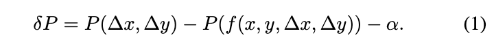
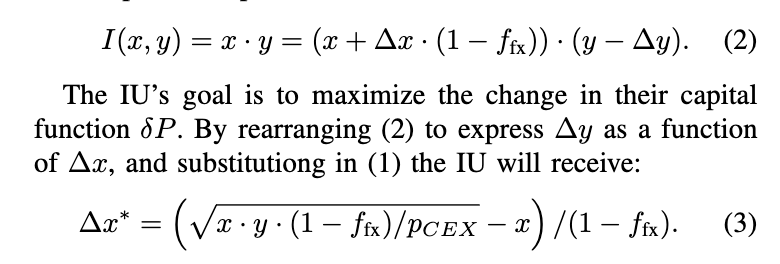

### Questions 

1. This formula 

2. The formula 

What if delta x is less than 0?

What about trades in the other direction? 

What does a corresponding delta y mean?

3. What are these values? 

(p, m, sigma)